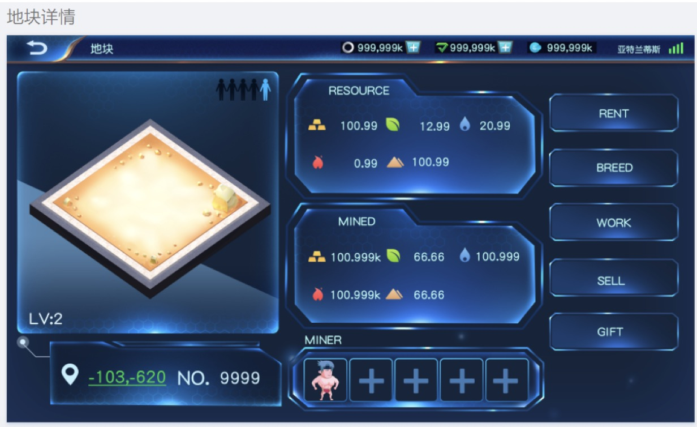
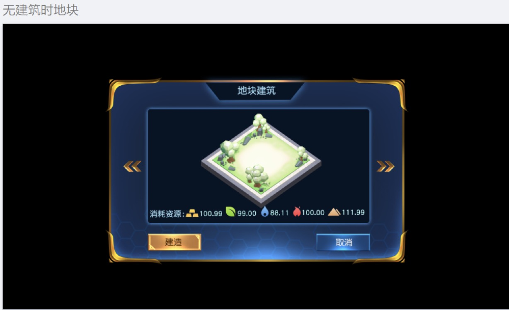

1.	点击地块后，弹出“查看”按钮——点击“查看”按钮——进入对应地块的地块详情界面（在地块界面之下有）

 

2.	点击右侧第五个按钮

3.	地块上建筑等级为0时（即无建筑时）进入无建筑时地块界面，玩家可点击左右选择地块建筑模型进行查看（地块模型使用该地块模型，通过点击左右，地块上的建筑模型预览发生变化，默认显示别墅）
 

4.	玩家资源不够建造建筑时，建造按钮灰显，不足的资源以红字标识（如该建筑需要金木水火土各500，玩家金仅有231，则消耗资源处的金500为红字）（后续升级也采用同样的逻辑，不再赘述）

5.	玩家点击建造，资源足够，并签名确认后，出现建造成功的飘字

6.	建造/升级建筑后，世界地图/地块详情页展示对应变化；地块详情页建筑等级对应变化

7.	调整表结构，在原有地块表上增加a.地块外观类型（用于金1金2的区别）b.地块建筑类型c.地块建筑等级相关字段

8.	地块上建筑等级为1时，点击地块详情界面右侧第五个按钮，进入有建筑时地块界面，界面大致与上图相同，区别在于：
(1)	没有左右箭头
(2)	建造变为升级
(3)	消耗资源显示的为该建筑升级所需资源

9.	地块上建筑等级为2时，点击地块详情界面右侧第五个按钮，进入有建筑时地块界面，界面大致与上图相同，区别在于：
(1)	没有左右箭头
(2)	建造变为已满级，按钮灰显
(3)	消耗资源处为空

10.	建造与升级需要的对应资源暂定为：

|	| 别墅 |	树屋  |	宝塔 | 日式 | 科技 |
|---|----- |----- |-----|------|-----|	
|建造|金20木10水10火10土10|	金10木20水10火10土10|	金10木10水10火20土10|	金10木10水20火10土10	| 金10木10水10火10土20|
|升级至lv.2|	金50木30水30火30土30|	金30木50水30火30土30|	金30木30水30火50土30|	金30木30水50火30土30|	金30木30水30火30土50|
